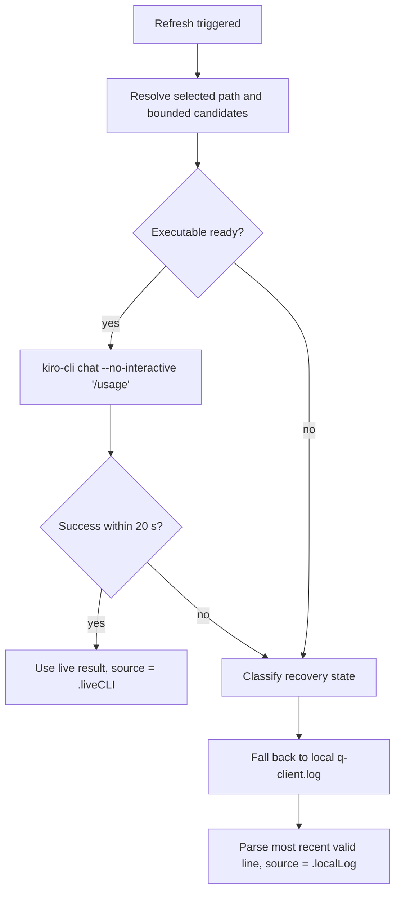

# Architecture

ACP Control Center is a macOS menu bar utility (SwiftUI `MenuBarExtra`)
providing read-only local ACP observation plus an explicitly confirmed,
app-managed wrapper workflow. Kiro CLI is the initial supported integration.

## Project paths

| Path | Role |
|------|------|
| `ACPControlCenter.xcodeproj` | **Canonical** Xcode project — manually maintained, committed directly. Source of truth for targets, build settings, signing, and scheme. |
| `Package.swift` | Secondary SwiftPM path for CLI builds (`swift build` / `swift test`). Useful for CI and contributors without Xcode open. |

There is no XcodeGen, `project.yml`, or generated project file. Both paths
compile the same source and test modules. The Xcode project remains the only
canonical source for native `.app` metadata, targets, and the shared scheme.

## Module structure

```
Sources/ACPControlCenter/
  ACPControlCenterApp.swift         App entry, MenuBarExtra, AppDelegate
  ACPProviderLifecycle.swift        Observation enum, lifecycle classifier, state context
  DashboardView.swift               SwiftUI dashboard popover
  DashboardViewModel.swift          Composes readers, formats menu bar label
  DomainModels.swift                Value types and ReaderError
  KiroCLIResolver.swift             Bounded discovery, selected path, version
  KiroUsageReader.swift             Local q-client.log reader (fallback)
  KiroUsageLiveReader.swift         Live CLI /usage reader (primary)
  KiroModelObservationReader.swift  Latest model/agent observation
  ACPWrapperReader.swift            Xcode ACP plist/wrapper parser, structured observations
  ACPWrapperManager.swift           Structured render, atomic install, rollback
  ACPWrapperManagerView.swift       State-aware setup/status/onboarding UI
  ProcessRunner.swift               Bounded subprocess helper
  UTF8LineScanner.swift             Incremental bounded-memory log scanner
  PathRedactor.swift                Home-directory prefix redaction for diagnostics
```

## Live usage → fallback flow



The live reader executes a bounded `Process` with a 20-second timeout. On
success the dashboard shows "Live from Kiro CLI" with the current timestamp.
On any failure (CLI missing, user not logged in, timeout, malformed output),
the local log reader provides stale-but-available data with a clear "Local
log (fallback)" indicator and the original observation timestamp. The UI keeps
authentication-required, expired-session, timeout, permission, command, and
parse failures distinct so the recovery action remains specific.

## Reader resource boundaries

Each reader addresses a specific resource dimension:

- **UTF8LineScanner** reads log files line-by-line without loading entire
  files into memory. The scanner enforces a maximum line size of 1 MiB
  (`maxLineBytes`). Lines exceeding this limit are skipped entirely (not
  truncated or emitted partially), ensuring bounded memory usage regardless
  of input content. Only structural JSON fields (usage, model ID, agent
  mode) are decoded; prompts and conversation content are discarded.
- **ProcessRunner** enforces a configurable timeout on all subprocess
  invocations. Process output is redirected to temporary files in a private
  directory (POSIX 0700) under the system temporary directory; individual
  files use POSIX 0600 permissions. Output is transiently buffered in these
  files and removed best-effort on completion. In the event of a crash, temp
  files may remain for the OS's periodic temp-directory cleanup. Captured
  output reads are bounded to 1 MiB per stream; output exceeding this cap
  is truncated with a clear marker while the process continues draining to
  the file until it exits. The ACP wrapper is passed to `/bin/zsh -n`
  (syntax-only, no execution). The CLI is invoked with `--version` or the
  `/usage` slash command only.
- **File discovery** (KiroUsageReader, KiroModelObservationReader,
  ACPWrapperReader) traverses configured root directories using
  `FileManager` enumeration. The roots are narrow (e.g.
  `~/Library/Application Support/Kiro/logs`, `~/.kiro/logs`,
  `~/Library/Developer/Xcode/CodingAssistant/ACP`) so the traversal is
  naturally scoped by directory structure. No explicit depth or count cap is
  currently enforced on file discovery itself.

## Managed-wrapper write boundary

Observation remains read-only outside ACC's private managed-wrapper directory:

- **Reads** local log files, plist configuration, and wrapper script text.
- **Invokes** `kiro-cli --version` and `kiro-cli chat --no-interactive '/usage'`.
- **Persists** only a manually selected Kiro CLI executable path in app
  `UserDefaults`.
- **Syntax-checks** wrappers via `/bin/zsh -n` (does not execute them).
- **Renders** managed wrappers only from structured executable/model/effort
  values and a fixed HOME/PATH environment allowlist.
- **Writes** only under
  `~/.local/share/acp-control-center/wrappers/` after preview and
  explicit confirmation.
- **First-time setup** rejects any existing destination.
- **Migration** reads an unmanaged wrapper, then re-renders an ACC-format
  managed wrapper; the unmanaged source file is left untouched.
- **Edit and rollback** back up the current managed wrapper first, replace it
  atomically, then verify parse, syntax, ownership marker, permissions, and
  read-back content. If post-write verification fails, the previous managed
  wrapper is restored automatically.
- **Never writes** Kiro files, credentials, or Xcode ACP plist files.
- **Never opens** Kiro IDE or submits prompts.

Xcode provider onboarding remains manual: the app can copy/reveal the managed
wrapper path and explain the fields, then **Rescan Xcode** verifies the
Xcode-owned plist afterward.

## Provider lifecycle classification

The dashboard classifies the current ACP provider state by combining:

1. A structured **provider observation** from `ACPWrapperReader` (noProvider,
   configuredPathMissing, wrapperInvalid, wrapperValid).
2. Whether the **exact canonical managed wrapper file** exists at its fixed
   target URL.

Classification rules drive state-aware UX:

| Provider observation | Managed artifact state | State |
|---------------------|----------------------|-------|
| noProvider | absent | `noProvider` |
| noProvider | valid (all checks pass) | `managedWrapperInactive` |
| noProvider | exists but invalid | `managedWrapperInvalid` |
| configuredPathMissing | absent | `configuredPathMissing` |
| configuredPathMissing | valid | `managedWrapperInactive` |
| configuredPathMissing | exists but invalid | `managedWrapperInvalid` |
| wrapperInvalid at managed URL | — | `managedWrapperInvalid` |
| wrapperInvalid at other URL | any | `unmanagedWrapperInvalid` |
| wrapperValid at managed URL | valid | `managedWrapperActive` |
| wrapperValid at managed URL | not valid | `managedWrapperInvalid` |
| wrapperValid at other URL | valid | `managedWrapperInactive` |
| wrapperValid at other URL | absent/invalid | `unmanagedWrapperActive` |

Ownership requires exact standardized URL equality with
`ACPWrapperManager.wrapperURL` PLUS full structured artifact validity:
non-symlink regular file with the ownership marker comment, parseable ACP
invocation, and passing `/bin/zsh -n` syntax validation. Symlinks resolving
to the managed target are explicitly rejected for ownership. Inspection
errors fail closed — they are never treated as "absent" or "valid".
