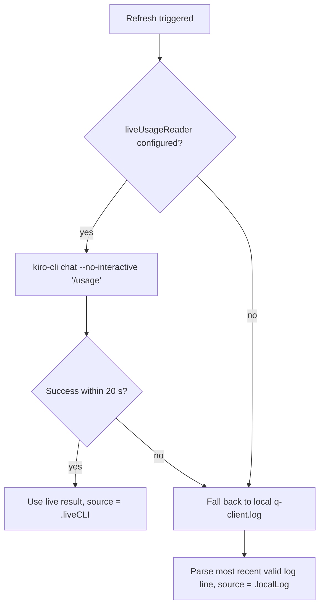

# Architecture

ACP Control Center is a macOS menu bar utility (SwiftUI `MenuBarExtra`)
providing read-only observability into a local ACP environment. Kiro CLI is
the initial supported integration, providing account credit usage, observed
model/session activity, and Xcode ACP wrapper state.

## Project paths

| Path | Role |
|------|------|
| `ACPControlCenter.xcodeproj` | **Canonical** Xcode project — manually maintained, committed directly. Source of truth for targets, build settings, signing, and scheme. |
| `Package.swift` | Secondary SwiftPM path for CLI builds (`swift build` / `swift test`). Useful for CI and contributors without Xcode open. |

There is no XcodeGen, `project.yml`, or generated project file. Both paths
compile the same source and test modules. The Xcode project remains the only
canonical source for native `.app` metadata, targets, and the shared scheme.

## Module structure

```
Sources/ACPControlCenter/
  ACPControlCenterApp.swift         App entry, MenuBarExtra, AppDelegate
  DashboardView.swift               SwiftUI dashboard popover
  DashboardViewModel.swift          Composes readers, formats menu bar label
  DomainModels.swift                Value types and ReaderError
  KiroCLIResolver.swift             Resolves kiro-cli path/version
  KiroUsageReader.swift             Local q-client.log reader (fallback)
  KiroUsageLiveReader.swift         Live CLI /usage reader (primary)
  KiroModelObservationReader.swift  Latest model/agent observation
  ACPWrapperReader.swift            Xcode ACP plist/wrapper parser
  ProcessRunner.swift               Bounded subprocess helper
  UTF8LineScanner.swift             Incremental bounded-memory log scanner
  PathRedactor.swift                Home-directory prefix redaction for diagnostics
```

## Live usage → fallback flow



The live reader executes a bounded `Process` with a 20-second timeout. On
success the dashboard shows "Live from Kiro CLI" with the current timestamp.
On any failure (CLI missing, user not logged in, timeout, malformed output),
the local log reader provides stale-but-available data with a clear "Local
log (fallback)" indicator and the original observation timestamp.

## Reader resource boundaries

Each reader addresses a specific resource dimension:

- **UTF8LineScanner** reads log files line-by-line without loading entire
  files into memory. The scanner enforces a maximum line size of 1 MiB
  (`maxLineBytes`). Lines exceeding this limit are skipped entirely (not
  truncated or emitted partially), ensuring bounded memory usage regardless
  of input content. Only structural JSON fields (usage, model ID, agent
  mode) are decoded; prompts and conversation content are discarded.
- **ProcessRunner** enforces a configurable timeout on all subprocess
  invocations. Process output is redirected to temporary files in a private
  directory (POSIX 0700) under the system temporary directory; individual
  files use POSIX 0600 permissions. Output is transiently buffered in these
  files and removed best-effort on completion. In the event of a crash, temp
  files may remain for the OS's periodic temp-directory cleanup. Captured
  output reads are bounded to 1 MiB per stream; output exceeding this cap
  is truncated with a clear marker while the process continues draining to
  the file until it exits. The ACP wrapper is passed to `/bin/zsh -n`
  (syntax-only, no execution). The CLI is invoked with `--version` or the
  `/usage` slash command only.
- **File discovery** (KiroUsageReader, KiroModelObservationReader,
  ACPWrapperReader) traverses configured root directories using
  `FileManager` enumeration. The roots are narrow (e.g.
  `~/Library/Application Support/Kiro/logs`, `~/.kiro/logs`,
  `~/Library/Developer/Xcode/CodingAssistant/ACP`) so the traversal is
  naturally scoped by directory structure. No explicit depth or count cap is
  currently enforced on file discovery itself.

## Read-only scope (current implementation)

This is the read-only MVP (Slices 1–3). The app:

- **Reads** local log files, plist configuration, and wrapper script text.
- **Invokes** `kiro-cli --version` and `kiro-cli chat --no-interactive '/usage'`.
- **Syntax-checks** the wrapper via `/bin/zsh -n` (does not execute it).
- **Never writes** to any Kiro, Xcode, or wrapper file.
- **Never opens** Kiro IDE or submits prompts.

Wrapper management (writing model/effort changes) is planned as a future
slice and is not implemented.
