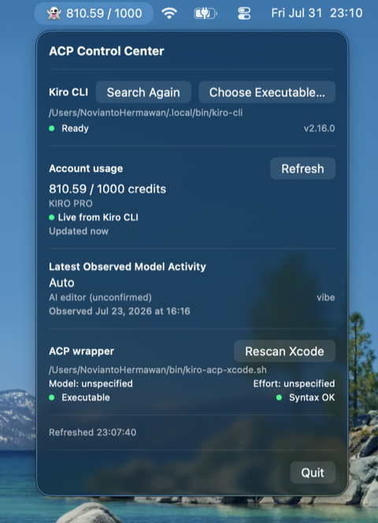

# ACP Control Center
<h2 align="center"></h2>

An unofficial macOS menu bar app (SwiftUI `MenuBarExtra`) providing local ACP
observability and a preview-first managed-wrapper workflow — currently
supporting Kiro CLI as its initial integration.

> ACP Control Center is an independent, unofficial project and is not
> affiliated with or endorsed by Kiro or AWS. Code signing and distribution
> configuration are still pending.

## Current scope

Account, model, CLI, and Xcode ACP discovery remain read-only. The optional
wrapper manager provides a structured first-time setup flow: it classifies
provider lifecycle state, generates a preview of the managed wrapper, and
installs only to its private directory after explicit confirmation. It never
writes Kiro files or Xcode ACP plist files.

The lifecycle classifier distinguishes seven states (no provider, configured
path missing, unmanaged wrapper invalid, managed wrapper invalid, unmanaged
wrapper active, managed wrapper inactive, managed wrapper active) and exposes
state-specific actions in the dashboard. Unmanaged wrappers are strictly
read-only; the app never modifies paths it does not own. After first-time
setup, the UI transitions to a "Finish Xcode Setup" flow that provides the
managed wrapper path for manual Xcode configuration.

Editing an existing active managed wrapper and migration of unmanaged
wrappers are planned for later work packages.

## What it reads

| Source | Default path | Purpose |
|--------|-------------|---------|
| Kiro CLI | selected path, known install paths, then `PATH` | bounded discovery + version check (`--version`) |
| Live usage | `kiro-cli chat --no-interactive '/usage'` | live credit usage, plan, reset date |
| Usage logs (fallback) | `~/Library/Application Support/Kiro/logs/**/q-client.log` | credit usage when live fails |
| Agent logs | `~/.kiro/logs/*/kiro.log` | observed model ID, agent mode, attribution |
| Xcode ACP plist | `~/Library/Developer/Xcode/CodingAssistant/ACP/*.plist` | configured wrapper path |
| ACP wrapper script | (path from plist) | parsed as text — never executed |

All readers accept injected paths for testing.

## Safe managed wrapper

The **Set Up/Create Managed Replacement** flow renders a wrapper from
structured executable, model, and effort fields. Before installation it
displays the complete generated script. An explicitly confirmed first-time
install then:

1. writes a private sibling temporary file;
2. validates it with `/bin/zsh -n`;
3. re-checks that the destination is still absent;
4. atomically installs it with permission `0700`;
5. reads it back and validates it again, removing only its own unchanged bytes
   if verification fails.

Managed files live under:

```text
~/.local/share/acp-control-center/wrappers/
```

This intentionally has no spaces so it remains suitable for Xcode's agent
executable field. The app can copy/reveal the path and shows the manual fields.
Xcode remains responsible for creating and owning its ACP provider plist.

## Menu bar label

The app displays a compact 8 pt status label in the menu bar:

- Loading: `👻 …`
- Success: `👻 USED / LIMIT` (e.g. `👻 771.21 / 1000`)
- Fallback: `👻 USED / LIMIT ⚠`
- Unavailable: `👻 —`

The label uses `.medium` weight, `.rounded` design, and `.monospacedDigit()`
for stable numeric width without a fixed frame.

## Requirements

- macOS 14+
- Xcode 16+ / Swift 6 toolchain
- No third-party runtime dependencies (Foundation, SwiftUI, Observation,
  Testing); SwiftLint is a pinned build-time quality dependency
- Live refresh requires `kiro-cli` installed and user logged in
- Missing or moved CLI installations can be rescanned or selected with a
  standard macOS file picker
- Wrapper installation is opt-in and requires preview plus confirmation

## Build

The canonical project file is `ACPControlCenter.xcodeproj` (manually
maintained, never generated). `Package.swift` is the secondary SwiftPM path.

```bash
# Xcode
open ACPControlCenter.xcodeproj
# ⌘B to build, ⌘U to test

# SwiftPM CLI
swift build
```

## Test

```bash
# SwiftPM
swift test

# Xcode project (CI-compatible)
xcodebuild test \
  -project ACPControlCenter.xcodeproj \
  -scheme ACPControlCenter \
  -derivedDataPath .derivedData \
  CODE_SIGNING_ALLOWED=NO
```

All tests use sanitized fixtures — no test reads real user data.

## Run

```bash
swift run ACPControlCenter
```

For a smoke test without opening the menu:

```bash
swift run ACPControlCenter --diagnostic
```

## Documentation

- [Architecture](Docs/Architecture.md) — project structure, live/fallback
  flow, reader resource design
- [Privacy](Docs/Privacy.md) — data boundaries, network activity, no-sandbox
  rationale
- [Roadmap](Docs/Roadmap.md) — implemented MVP, planned wrapper manager
  phases, attribution research

## Contributing

See [CONTRIBUTING.md](CONTRIBUTING.md).

## License

Licensed under the [Apache License 2.0](LICENSE).

## Security

See [SECURITY.md](SECURITY.md). Never paste raw Kiro logs or credentials
into public issues.

## Known limitations

- The app does not add or modify Xcode ACP providers automatically; managed
  wrappers must be selected through Xcode Settings
- Model IDs are validated structured input but are not yet discovered from a
  provider model catalog
- `origin=AI_EDITOR` displayed as "AI editor (unconfirmed)" — cannot
  reliably distinguish Kiro IDE from Xcode ACP
- Dashboard performs an initial refresh and offers separate CLI search,
  account refresh, and Xcode rescan actions, but does not continuously watch
  local files
- Live `/usage` parser depends on current CLI text format; falls back
  gracefully if format changes
