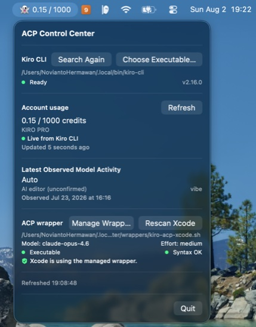

# ACP Control Center
<p align="center">
  
</p>

An unofficial macOS menu bar app (SwiftUI `MenuBarExtra`) providing local ACP
observability and a preview-first managed-wrapper workflow — currently
supporting Kiro CLI as its initial integration.

> ACP Control Center is an independent, unofficial project and is not
> affiliated with or endorsed by Kiro or AWS. Code signing and distribution
> configuration are still pending.

## Current scope

ACP Control Center provides local ACP observability and a preview-first managed
wrapper lifecycle for Xcode ACP usage with Kiro CLI. It discovers account
usage, observed model activity, CLI readiness, and Xcode ACP configuration.
The wrapper manager supports first-time setup, migration from an unmanaged
wrapper, in-place model/effort edits, backup history, rollback, and
post-install verification.

It never writes Kiro files or Xcode ACP plist files. Xcode provider
configuration remains manual; ACP Control Center manages only its own wrapper
under its private app directory.

The lifecycle classifier distinguishes seven states (no provider, configured
path missing, unmanaged wrapper invalid, managed wrapper invalid, unmanaged
wrapper active, managed wrapper inactive, managed wrapper active) and exposes
state-specific actions in the dashboard. Unmanaged wrappers are strictly
read-only; migration re-renders them into ACC's managed format without
modifying the original source file. After setup or migration, the UI provides
the managed wrapper path for manual Xcode configuration.

## What it reads

| Source | Default path | Purpose |
|--------|-------------|---------|
| Kiro CLI | selected path, known install paths, then `PATH` | bounded discovery + version check (`--version`) |
| Live usage | `kiro-cli chat --no-interactive '/usage'` | live credit usage, plan, reset date |
| Usage logs (fallback) | `~/Library/Application Support/Kiro/logs/**/q-client.log` | credit usage when live fails |
| Agent logs | `~/.kiro/logs/*/kiro.log` | observed model IDs, agent mode, attribution |
| Xcode ACP plist | `~/Library/Developer/Xcode/CodingAssistant/ACP/*.plist` | configured wrapper path |
| ACP wrapper script | (path from plist) | parsed as text — never executed |

All readers accept injected paths for testing.

## Safe managed wrapper lifecycle

The wrapper manager renders wrappers from structured executable, model, and
effort fields. Before installation it displays the complete generated script.
Supported lifecycle actions include:

- first-time managed wrapper setup;
- managed replacement when Xcode points to a missing path;
- explicit migration from an unmanaged wrapper;
- in-place model/effort edits;
- backup history and rollback;
- post-install verification with automatic restore on failure.

An explicitly confirmed install then:

1. writes a private sibling temporary file;
2. validates it with `/bin/zsh -n`;
3. verifies that the destination state is still safe for the requested action;
4. atomically installs it with permission `0700`;
5. reads it back and validates it again;
6. restores the previous managed wrapper automatically if replacement
   verification fails.

Every replacement backs up the previous managed wrapper first. First-time
setup still rejects existing destinations instead of replacing them.

Managed files live under:

```text
~/.local/share/acp-control-center/wrappers/
```

This intentionally has no spaces so it remains suitable for Xcode's agent
executable field. The app can copy/reveal the path and shows the manual fields.
Xcode remains responsible for creating and owning its ACP provider plist.

## Menu bar label

The app displays a compact 8 pt status label in the menu bar:

- Loading: `👻 …`
- Success: `👻 USED / LIMIT` (e.g. `👻 771.21 / 1000`)
- Fallback: `👻 USED / LIMIT ⚠`
- Unavailable: `👻 —`

The label uses `.medium` weight, `.rounded` design, and `.monospacedDigit()`
for stable numeric width without a fixed frame.

## Requirements

- macOS 14+
- Xcode 16+ / Swift 6 toolchain
- No third-party runtime dependencies (Foundation, SwiftUI, Observation,
  Testing); SwiftLint is a pinned build-time quality dependency
- Live refresh requires `kiro-cli` installed and user logged in
- Missing or moved CLI installations can be rescanned or selected with a
  standard macOS file picker
- Wrapper installation is opt-in and requires preview plus confirmation

## Install

### Option 1 — Homebrew (recommended)

```bash
brew tap IDN-Media/tap
brew install --cask acp-control-center
```

> The app is currently an unsigned build. On first launch, Gatekeeper may
> block it. If that happens, clear the download attributes once:
>
> ```bash
> xattr -dr com.apple.quarantine /Applications/ACPControlCenter.app
> xattr -dr com.apple.provenance /Applications/ACPControlCenter.app
> ```

### Option 2 — Manual ZIP from GitHub Releases

Grab the latest ZIP from
[GitHub Releases](https://github.com/IDN-Media/acp-control-center/releases):

```bash
# Download the latest ZIP, then:
unzip ACPControlCenter-<version>-macos.zip
mv ACPControlCenter.app /Applications/
```

### Opening an unsigned preview build

Preview builds are unsigned until Apple Developer signing is available.
macOS Gatekeeper will show *"cannot verify the developer"* the first time you
open it. To bypass:

**Option A — one-time xattr (fastest for developers):**

```bash
# macOS 14+: the download carries com.apple.provenance
xattr -dr com.apple.provenance /Applications/ACPControlCenter.app
# Classic attribute that also triggers Gatekeeper:
xattr -dr com.apple.quarantine /Applications/ACPControlCenter.app
```

**Option B — right-click Open:**

```text
Right-click ACPControlCenter.app → Open → click Open again
```

**Option C — System Settings:**

```text
System Settings → Privacy & Security → scroll to Security section
→ "Open Anyway" → Open
```

> Homebrew installs (Option 1) may still hit Gatekeeper — in that case use
> the same `xattr` command above.

For contributors, build from source with `swift build` (see Build below).

## Build

The canonical project file is `ACPControlCenter.xcodeproj` (manually
maintained, never generated). `Package.swift` is the secondary SwiftPM path.

```bash
# Xcode
open ACPControlCenter.xcodeproj
# ⌘B to build, ⌘U to test

# SwiftPM CLI
swift build
```

## Test

```bash
# SwiftPM
swift test

# Xcode project (CI-compatible)
xcodebuild test \
  -project ACPControlCenter.xcodeproj \
  -scheme ACPControlCenter \
  -destination 'platform=macOS' \
  -derivedDataPath .derivedData \
  CODE_SIGNING_ALLOWED=NO
```

All tests use sanitized fixtures — no test reads real user data.

## Run

```bash
swift run ACPControlCenter
```

For a smoke test without opening the menu:

```bash
swift run ACPControlCenter --diagnostic
```

## Documentation

- [Architecture](Docs/Architecture.md) — project structure, live/fallback
  flow, reader resource design
- [Privacy](Docs/Privacy.md) — data boundaries, network activity, no-sandbox
  rationale
- [Release](Docs/Release.md) — packaging, signing, notarization, publishing
- [Roadmap](Docs/Roadmap.md) — implemented lifecycle, release readiness, and
  attribution research

## Contributing

See [CONTRIBUTING.md](CONTRIBUTING.md).

## License

Licensed under the [Apache License 2.0](LICENSE).

## Security

See [SECURITY.md](SECURITY.md). Never paste raw Kiro logs or credentials
into public issues.

## Known limitations

- The app does not add or modify Xcode ACP providers automatically; managed
  wrappers must be selected through Xcode Settings
- Model suggestions come from observed local Kiro logs plus `auto`; there is
  no provider-supported local model catalog yet, so new model IDs can still be
  entered manually
- `origin=AI_EDITOR` displayed as "AI editor (unconfirmed)" — cannot
  reliably distinguish Kiro IDE from Xcode ACP
- Dashboard performs an initial refresh and offers separate CLI search,
  account refresh, and Xcode rescan actions, but does not continuously watch
  local files
- Live `/usage` parser depends on current CLI text format; falls back
  gracefully if format changes
